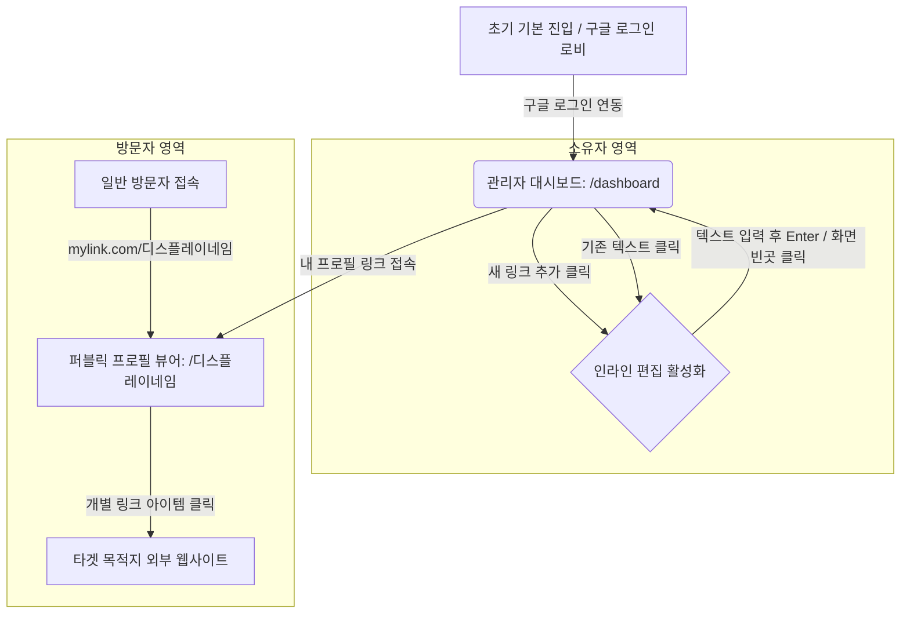

# 마이링크 화면 기획 및 와이어프레임 (Wireframe)

## 1. 개요

본 문서는 PRD 및 사용자 시나리오를 바탕으로, 마이링크(My-Link) 서비스의 주요 화면인 퍼블릭 프로필 뷰어(Public View)와 소유자 대시보드(Dashboard)의 **화면 흐름도(Mermaid)** 및 **UI 배치(ASCII 아트)**를 정의합니다.

---

## 2. 전체 화면 이동 흐름도 (Screen Flow)



---

## 3. 와이어프레임 상세 레이아웃 (ASCII Art)

모바일을 최우선 고려(Mobile-first)한 1단 중앙 정렬 레이아웃 구조입니다.

### 3.1. 퍼블릭 프로필 뷰어 (Public Viewer)

- **접근 주소:** `mylink.com/닉네임(displayName)`
- **용도:** 방문자가 들어왔을 때 보이는 '읽기 전용' 최종 노출 화면.

```text
+------------------------------------+
|                                    |
|              [ 공유 Icon ]           |
|                                    |
|             ( Dynamic )            | <-- username 첫 글자를 활용한 텍스트 기반
|             ( Avatar  )            |     동적인 배경색 아바타 자동 적용
|                                    |
|          이름 (username)            |
|         @닉네임 (displayName)         |
|                                    |
|   "안녕하세요! 제 포트폴리오와 소셜 미디어  |
|    링크를 한곳에 모아두었습니다."         |
|                                    |
|                                    |
|  +------------------------------+  |
|  | [Favicon]  개인 포트폴리오 사이트 |  |  <-- 링크 아이템 1
|  +------------------------------+  |
|                                    |
|  +------------------------------+  |
|  | [Favicon]  유튜브 채널 구경가기   |  |  <-- 링크 아이템 2
|  +------------------------------+  |
|                                    |
|  +------------------------------+  |
|  | [Favicon]  인스타그램 계정        |  |  <-- 링크 아이템 3
|  +------------------------------+  |
|                                    |
|                                    |
|          Powered by My-Link        |
+------------------------------------+
```

### 3.2. 소유자 대시보드 (Dashboard)

- **접근 주소:** `mylink.com/dashboard`
- **용도:** 소유자가 텍스트를 인라인으로 클릭하여 수정/갱신하는 관리자 영역 (퍼블릭 뷰와 분리)

```text
+------------------------------------+
|  [My-Link 로고]        [로그아웃]     |
+------------------------------------+
|                                    |
|  [ 내 프로필 설정 (클릭하여 ✏️ 수정) ]   |
|                                    |
|  [유저네임] 홍길동 ✏️                  |
|  [닉네임] @gildong ✏️                 |
|  [소개글] 안녕하세요! 방갑습니다. ✏️      |
|                                    |
|------------------------------------|
|                                    |
|        [ + 새로운 링크 추가 ]          |
|                                    |
|  +------------------------------+  |
|  |  [Favicon]                   |  |
|  |  [Title] 나의 블로그 ✏️          |  |
|  |  [ URL ] https://blog.co..✏️ |🗑️|
|  +------------------------------+  |
|                 ↑ (되돌리기 토스트 팝업 제안 영역)
|  +------------------------------+  |
|  |  [Favicon]                   |  |
|  |  [Title] 유튜브 채널 ✏️          |  |
|  |  [ URL ] https://youtube..✏️ |🗑️|
|  +------------------------------+  |
|                                    |
+------------------------------------+
```

---

## 4. 확정된 기획 및 라우팅 정책

질문과 제안을 통해 확정된 추가 정책 내용입니다.

1.  **동적 아바타(Dynamic Text Avatar) 일괄 적용:**
    - 사용자가 별도의 이미지를 업로드하지 않아도 렌더링 시 `username`의 첫 글자를 활용해 배경색이 자동으로 지정되는 텍스트 아바타 요소를 뷰어 상단에 배치합니다.
2.  **독립된 대시보드 접근 경로(Routing) 설계:**
    - 소유자의 프로필/링크 관리 화면은 `/dashboard` 경로를 따르며, 일반 방문자의 읽기 전용 뷰는 `/[닉네임]` 구조로 철저하게 분리 구축합니다.
3.  **별도의 기능 홍보 랜딩 웹페이지(홈) 배제:**
    - 구체적이고 무거운 안내용 랜딩 메인 페이지 구조는 그리지 않으며, 최초 접근 시 로그인/회원가입만 처리하는 가장 심플한 진입 로비 UI로 갈음합니다.
